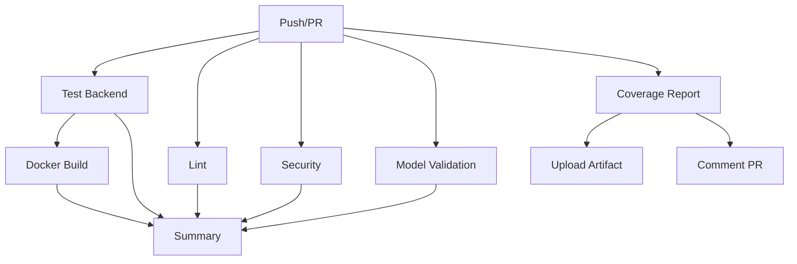

# 🚀 GitHub Actions Workflows

Ce dossier contient les workflows GitHub Actions pour l'automatisation CI/CD du projet CarPricePredictor-MA.

## 📋 Workflows Disponibles

### 1. 🧪 CI/CD Pipeline (`ci.yml`)

**Déclenchement:** Push sur `main` ou `develop`, Pull Requests vers `main`

**Jobs:**

#### 🧪 Test Backend
- Teste sur Python 3.11 et 3.12
- Exécute tous les tests Pytest
- Génère un rapport de couverture
- Upload vers Codecov

#### 🔍 Code Quality
- Linting avec Flake8
- Vérification du formatage avec Black
- Vérification des imports avec isort

#### 🔐 Security Scan
- Analyse des vulnérabilités avec Safety
- Scan des dépendances

#### 🐳 Docker Build Test
- Build de l'image Docker
- Test de l'image
- Rapport de la taille de l'image

#### 🤖 ML Model Validation
- Vérifie l'existence du modèle
- Valide le chargement du modèle
- Affiche les métadonnées

#### 📋 Build Summary
- Génère un résumé complet
- Affiche le statut de tous les jobs

### 2. 📊 Test Coverage (`test-coverage.yml`)

**Déclenchement:** Push sur `main`, Pull Requests vers `main`

**Fonctionnalités:**
- Génère un rapport de couverture détaillé
- Crée un commentaire avec les résultats
- Upload du rapport HTML comme artifact
- Seuils: 80% vert, 70% orange

## 🏗️ Structure des Jobs



## 🎯 Objectifs

✅ **Qualité du code** - Linting et formatage  
✅ **Tests automatiques** - 27 tests unitaires  
✅ **Sécurité** - Scan des vulnérabilités  
✅ **Docker** - Build et validation  
✅ **ML Model** - Validation du modèle  
✅ **Coverage** - Minimum 80%  

## 📊 Badges

Les badges suivants sont disponibles dans le README principal:

- [](https://github.com/Saidouchrif/CarPricePredictor-MA/actions/workflows/ci.yml)
- [](https://github.com/Saidouchrif/CarPricePredictor-MA/actions/workflows/test-coverage.yml)

## 🔧 Configuration

### Pytest
Configuration dans `backend/pytest.ini`:
- Testpaths: `tests/`
- Coverage source: `app/`
- Markers: unit, integration, slow, api

### Flake8
Configuration dans `backend/.flake8`:
- Max line length: 127
- Max complexity: 10
- Ignore: E203, W503, E501

### Dependabot
Configuration dans `.github/dependabot.yml`:
- Mise à jour hebdomadaire (lundi 9h)
- Backend, Frontend, GitHub Actions, Docker
- Auto-assign à @Saidouchrif

## 📝 Utilisation Locale

Pour exécuter les mêmes tests localement:

```bash
# Tests
cd backend
pytest tests/ -v --cov=app --cov-report=html

# Linting
flake8 app/
black app/ --check
isort app/ --check-only

# Security
safety check -r requirements.txt

# Docker
docker build -t carprice:local .
```

## 🚨 Alertes

Les workflows échouent si:
- ❌ Tests Pytest échouent
- ❌ Build Docker échoue
- ❌ Modèle ML ne se charge pas

Les warnings sont affichés pour:
- ⚠️ Linting issues
- ⚠️ Vulnérabilités de sécurité
- ⚠️ Coverage < 80%

## 📚 Ressources

- [GitHub Actions Documentation](https://docs.github.com/en/actions)
- [Pytest Documentation](https://docs.pytest.org/)
- [Codecov Documentation](https://docs.codecov.com/)
- [Dependabot Documentation](https://docs.github.com/en/code-security/dependabot)

---

**Auteur:** Said Ouchrif  
**Dernière mise à jour:** 2025-01-06
