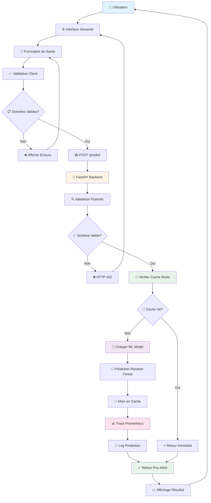
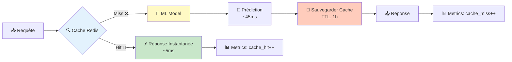
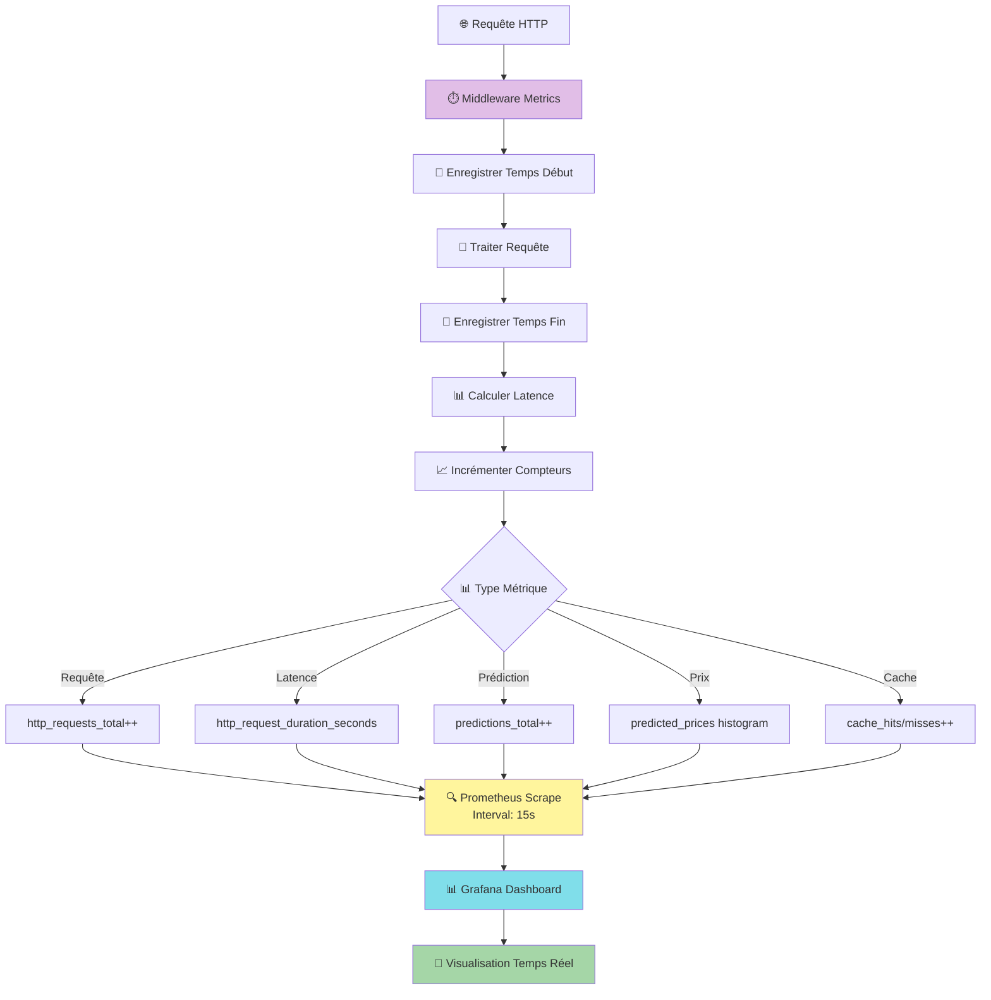
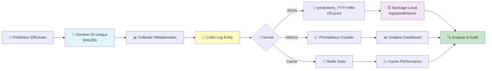
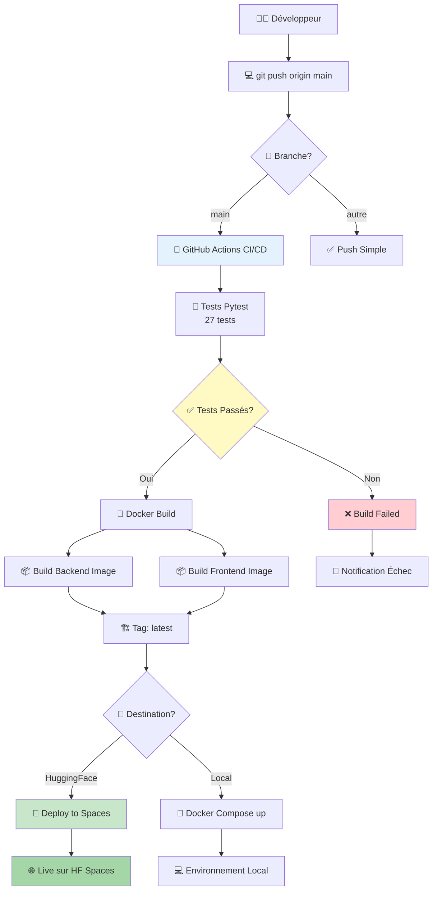
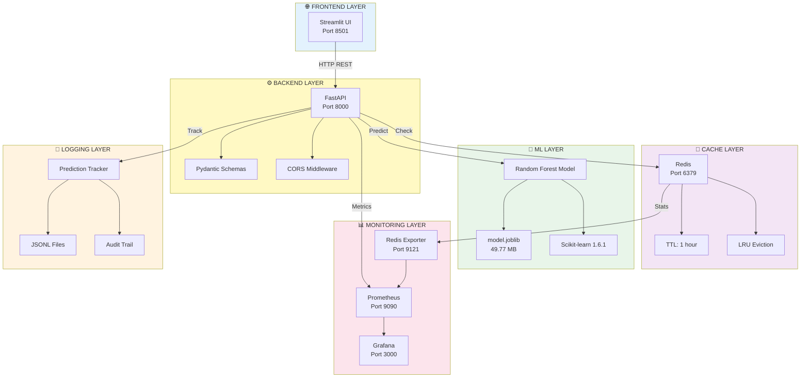

# 🚗 CarPricePredictor-MA

<div align="center">

[](https://www.python.org/downloads/)
[](https://fastapi.tiangolo.com)
[](https://streamlit.io)
[](https://scikit-learn.org)
[](https://www.docker.com)
[](LICENSE)

[](https://github.com/Saidouchrif/CarPricePredictor-MA/actions/workflows/ci.yml)
[](https://github.com/Saidouchrif/CarPricePredictor-MA/actions/workflows/test-coverage.yml)
[](https://codecov.io/gh/Saidouchrif/CarPricePredictor-MA)

**Application complète de Machine Learning pour estimer le prix des voitures d'occasion au Maroc**

[🌐 Demo Live](https://huggingface.co/spaces/SaidOuchrif/CarPricePredictor-MA) • [📖 GitHub](https://github.com/Saidouchrif/CarPricePredictor-MA) • [🤗 Hugging Face](https://huggingface.co/spaces/SaidOuchrif/CarPricePredictor-MA)

</div>

---

## 📋 Table des Matières

- [Vue d'ensemble](#-vue-densemble)
- [Architecture du Projet](#️-architecture-du-projet)
- [Structure des Dossiers](#-structure-des-dossiers)
- [Technologies Utilisées](#-technologies-utilisées)
- [Fonctionnalités](#-fonctionnalités)
- [Installation](#-installation)
- [Utilisation](#-utilisation)
- [API Documentation](#-api-documentation)
- [Monitoring](#-monitoring)
- [Tests](#-tests)
- [Déploiement](#-déploiement)
- [Contributeur](#-contributeur)
- [Licence](#-licence)

---

## 🎯 Vue d'ensemble

**CarPricePredictor-MA** est une application full-stack de Machine Learning qui permet d'estimer le prix réel d'une voiture d'occasion au Maroc à partir de ses caractéristiques techniques et de son état.

### Problématique

Le marché des voitures d'occasion au Maroc manque de transparence dans la tarification. Les acheteurs ont du mal à déterminer si le prix proposé est juste.

### Solution

Une application web complète avec:
- 🎯 **Estimation précise** basée sur Random Forest
- ⚡ **Performance optimale** avec cache Redis
- 📊 **Monitoring complet** Prometheus + Grafana
- 🔒 **API REST** avec FastAPI
- 💻 **Interface intuitive** Streamlit
- 🐳 **Docker ready**

---

## 🏗️ Architecture du Projet

### 📐 Architecture Globale en Couches

```
┌─────────────────────────────────────────────────────────────────┐
│                    COUCHE PRÉSENTATION                          │
│  ┌───────────────────────────────────────────────────────────┐  │
│  │              Streamlit Frontend (Port 8501)               │  │
│  │  ┌──────────┐  ┌──────────┐  ┌──────────┐                │  │
│  │  │ Input    │  │ Display  │  │  Error   │                │  │
│  │  │ Form     │  │ Results  │  │ Handling │                │  │
│  │  └──────────┘  └──────────┘  └──────────┘                │  │
│  └───────────────────────────────────────────────────────────┘  │
└──────────────────────────┬──────────────────────────────────────┘
                           │
                           │ HTTP REST API (JSON)
                           │
┌──────────────────────────┴──────────────────────────────────────┐
│                    COUCHE APPLICATION                           │
│  ┌───────────────────────────────────────────────────────────┐  │
│  │              FastAPI Backend (Port 8000)                  │  │
│  │                                                           │  │
│  │  ┌──────────┐  ┌──────────┐  ┌──────────┐               │  │
│  │  │ /predict │  │ /health  │  │ /metrics │               │  │
│  │  └────┬─────┘  └────┬─────┘  └────┬─────┘               │  │
│  │       │             │              │                      │  │
│  │  ┌────▼────────────────────────────▼─────┐               │  │
│  │  │        Middleware Layer                │               │  │
│  │  │  - CORS                                │               │  │
│  │  │  - Prometheus Metrics                  │               │  │
│  │  │  - Error Handling                      │               │  │
│  │  └────────────────────────────────────────┘               │  │
│  └───────────────────────────────────────────────────────────┘  │
└──────────────────────┬──────────┬──────────┬────────────────────┘
                       │          │          │
         ┌─────────────┴──┐  ┌────┴────┐  ┌─┴────────────┐
         │                │  │         │  │              │
┌────────▼─────────┐  ┌──▼──▼──────┐  │  ┌▼──────────────▼──────┐
│  COUCHE CACHE    │  │COUCHE LOGIC│  │  │  COUCHE MONITORING   │
│                  │  │            │  │  │                      │
│  ┌────────────┐  │  │ ┌────────┐ │  │  │  ┌────────────────┐ │
│  │   Redis    │  │  │ │   ML   │ │  │  │  │  Prometheus    │ │
│  │   Cache    │  │  │ │ Model  │ │  │  │  │   Collector    │ │
│  │ Port 6379  │  │  │ │        │ │  │  │  │   Port 9090    │ │
│  └────────────┘  │  │ └────────┘ │  │  │  └────────┬───────┘ │
│                  │  │            │  │  │           │          │
│  - TTL: 1h       │  │ Random     │  │  │  ┌────────▼───────┐ │
│  - LRU eviction  │  │ Forest     │  │  │  │    Grafana     │ │
└──────────────────┘  └────────────┘  │  │  │   Dashboard    │ │
                                      │  │  │   Port 3000    │ │
                                      │  │  └────────────────┘ │
┌─────────────────────────────────────┘  └─────────────────────┘
│         COUCHE TRAÇABILITÉ
│  ┌────────────────────────────────┐
│  │    Prediction Tracker          │
│  │  - Logs JSONL                  │
│  │  - Audit Trail                 │
│  │  - Model Versioning            │
│  └────────────────────────────────┘
└────────────────────────────────────
```

### 🔄 Diagramme de Séquence - Flux de Prédiction

```
Utilisateur    Frontend     Backend      Redis     ML Model    Prometheus    Logs
    │             │            │           │          │            │          │
    │  1. Saisie  │            │           │          │            │          │
    │─────────────>│            │           │          │            │          │
    │             │            │           │          │            │          │
    │             │ 2. POST    │           │          │            │          │
    │             │  /predict  │           │          │            │          │
    │             │────────────>│           │          │            │          │
    │             │            │           │          │            │          │
    │             │            │ 3. Check  │          │            │          │
    │             │            │  Cache    │          │            │          │
    │             │            │───────────>│          │            │          │
    │             │            │           │          │            │          │
    │             │            │ 4a. MISS  │          │            │          │
    │             │            │<───────────│          │            │          │
    │             │            │           │          │            │          │
    │             │            │ 5. Predict│          │            │          │
    │             │            │──────────────────────>│            │          │
    │             │            │           │          │            │          │
    │             │            │ 6. Price  │          │            │          │
    │             │            │<──────────────────────│            │          │
    │             │            │           │          │            │          │
    │             │            │ 7. Cache  │          │            │          │
    │             │            │  Result   │          │            │          │
    │             │            │───────────>│          │            │          │
    │             │            │           │          │            │          │
    │             │            │ 8. Track Metrics      │            │          │
    │             │            │───────────────────────────────────>│          │
    │             │            │           │          │            │          │
    │             │            │ 9. Log Prediction                  │          │
    │             │            │────────────────────────────────────────────────>│
    │             │            │           │          │            │          │
    │             │ 10. JSON   │           │          │            │          │
    │             │  Response  │           │          │            │          │
    │             │<────────────│           │          │            │          │
    │             │            │           │          │            │          │
    │ 11. Afficher│            │           │          │            │          │
    │<─────────────│            │           │          │            │          │
    │             │            │           │          │            │          │
```

### 🌐 Diagramme de Déploiement Docker

```
┌────────────────────────────────────────────────────────────────┐
│                      Docker Network: monitoring                │
│                                                                │
│  ┌──────────────────┐         ┌──────────────────┐            │
│  │  Frontend        │         │  Backend         │            │
│  │  Container       │         │  Container       │            │
│  │                  │         │                  │            │
│  │  Streamlit       │<──REST──│  FastAPI         │            │
│  │  Port: 8501      │         │  Port: 8000      │            │
│  │                  │         │                  │            │
│  │  Image:          │         │  Image:          │            │
│  │  python:3.11     │         │  python:3.11     │            │
│  └──────────────────┘         └────────┬─────────┘            │
│                                        │                       │
│                          ┌─────────────┼─────────────┐         │
│                          │             │             │         │
│  ┌──────────────────┐    │   ┌─────────▼─────────┐   │         │
│  │  Redis           │<───┴───│  ML Model         │   │         │
│  │  Container       │        │  (In Backend)     │   │         │
│  │                  │        │                   │   │         │
│  │  Image:          │        │  model.joblib     │   │         │
│  │  redis:7-alpine  │        │  49.77 MB         │   │         │
│  │  Port: 6379      │        └───────────────────┘   │         │
│  └────────┬─────────┘                                │         │
│           │                                          │         │
│  ┌────────▼─────────┐    ┌───────────────────┐      │         │
│  │  Prometheus      │    │  Grafana          │      │         │
│  │  Container       │    │  Container        │      │         │
│  │                  │◄───│                   │      │         │
│  │  Image:          │    │  Image:           │      │         │
│  │  prom/prometheus │    │  grafana/grafana  │      │         │
│  │  Port: 9090      │    │  Port: 3000       │      │         │
│  └──────────────────┘    └───────────────────┘      │         │
│                                                      │         │
│  ┌──────────────────┐                                │         │
│  │  Redis Exporter  │                                │         │
│  │  Container       │                                │         │
│  │                  │                                │         │
│  │  Port: 9121      │────────────────────────────────┘         │
│  └──────────────────┘                                          │
│                                                                │
│  Volume Mounts:                                                │
│  - prometheus_data  → /prometheus                              │
│  - grafana_data     → /var/lib/grafana                         │
│  - redis_data       → /data                                    │
└────────────────────────────────────────────────────────────────┘
```

### 📡 Communication entre Services

```
┌──────────────────────────────────────────────────────────┐
│                   FLUX DE DONNÉES                        │
└──────────────────────────────────────────────────────────┘

Requête Utilisateur
       │
       ▼
┌──────────────┐  Port 8501
│  Streamlit   │  Protocol: HTTP
│  Frontend    │  Format: Form Data
└──────┬───────┘
       │
       │ [POST /predict]
       │ Content-Type: application/json
       │ Body: CarFeatures
       │
       ▼
┌──────────────┐  Port 8000
│   FastAPI    │  Protocol: HTTP REST
│   Backend    │  Format: JSON
└──┬────┬───┬──┘
   │    │   │
   │    │   └──────────────────┐
   │    │                      │
   │    │               [GET /metrics]
   │    │                      │
   │    │                      ▼
   │    │              ┌───────────────┐  Port 9090
   │    │              │  Prometheus   │  Protocol: HTTP
   │    │              │   Scraper     │  Format: Text (Metrics)
   │    │              └───────┬───────┘
   │    │                      │
   │    │                      │ [Pull Metrics]
   │    │                      │
   │    │                      ▼
   │    │              ┌───────────────┐  Port 3000
   │    │              │   Grafana     │  Protocol: HTTP
   │    │              │  Dashboards   │  Format: PromQL
   │    │              └───────────────┘
   │    │
   │    │ [Check Cache: GET key]
   │    │ Protocol: Redis Protocol
   │    │
   │    ▼
   │ ┌──────────────┐  Port 6379
   │ │    Redis     │  Protocol: RESP
   │ │    Cache     │  Format: Binary
   │ └──────┬───────┘
   │        │
   │        │ Cache Miss
   │        │
   │        ▼
   │ [Load Model & Predict]
   │
   ▼
┌──────────────┐
│  ML Model    │  In-Memory
│Random Forest │  Format: Joblib
└──────┬───────┘
       │
       │ [Return Prediction]
       │
       ▼
┌──────────────┐
│ Response to  │
│  Frontend    │
└──────────────┘


LÉGENDE:
━━━━  Communication HTTP/REST
═════  Communication Redis
─ ─ ─  Pull/Scrape Metrics
```

### 🔐 Sécurité et Validation

```
┌───────────────────────────────────────────────────┐
│            PIPELINE DE VALIDATION                 │
└───────────────────────────────────────────────────┘

Input (Frontend)
     │
     │ [User Input]
     │
     ▼
┌─────────────────┐
│ Client-Side     │
│ Validation      │
│ - Required      │
│ - Format        │
│ - Range         │
└────────┬────────┘
         │
         │ [Valid]
         │
         ▼
┌─────────────────┐
│ HTTP POST       │
│ with JSON       │
└────────┬────────┘
         │
         ▼
┌─────────────────┐
│ FastAPI         │
│ Pydantic Schema │
│ - Type Check    │
│ - Field Validate│
│ - Year: 1990-   │
│   2026          │
└────────┬────────┘
         │
         │ [Valid]
         │
         ▼
┌─────────────────┐
│ Business Logic  │
│ - Cache Check   │
│ - Model Predict │
│ - Log Track     │
└────────┬────────┘
         │
         ▼
    Response
```

### 🎨 Diagrammes de Flux Interactifs (Mermaid)

#### 📊 Flux Principal de Prédiction



#### 🔄 Flux avec Cache Redis



#### 📈 Flux de Monitoring



#### ⚠️ Flux de Gestion des Erreurs

```mermaid
graph TD
    A[📥 Requête Entrante] --> B{🔍 Type Erreur?}
    B -->|Validation| C[❌ HTTP 422]
    B -->|Model Non Chargé| D[❌ HTTP 503]
    B -->|Erreur Interne| E[❌ HTTP 500]
    B -->|✅ Succès| F[✅ HTTP 200]
    
    C --> G[📝 Log: Validation Error]
    D --> H[📝 Log: Service Unavailable]
    E --> I[📝 Log: Internal Error]
    F --> J[📝 Log: Success]
    
    G --> K[📊 Metrics: errors++]
    H --> K
    I --> K
    
    J --> L[📊 Metrics: success++]
    
    K --> M[🔔 Prometheus Alert?]
    M -->|Seuil Dépassé| N[🚨 Alerte Email/Slack]
    M -->|Normal| O[✅ Surveillance Continue]
    
    L --> O
    
    style C fill:#ffcdd2
    style D fill:#ffcdd2
    style E fill:#ffcdd2
    style F fill:#c8e6c9
    style N fill:#ff6b6b
```



#### 🗄️ Flux de Traçabilité



#### 🚀 Flux de Déploiement



#### 🏗️ Architecture des Composants



---

## 📁 Structure des Dossiers

```
CarPricePredictor-MA/
│
├── 📂 backend/                      # Backend FastAPI
│   ├── app/
│   │   ├── main.py                  # API principale
│   │   ├── schemas.py               # Validation Pydantic
│   │   ├── cache.py                 # Cache Redis
│   │   ├── monitoring.py            # Métriques Prometheus
│   │   └── prediction_tracker.py    # Traçabilité
│   ├── tests/                       # 27 tests unitaires
│   │   ├── test_main.py             # Tests API
│   │   └── test_schemas.py          # Tests schémas
│   └── requirements.txt             # Dépendances
│
├── 📂 frontend/                     # Frontend Streamlit
│   ├── app.py                       # Interface web
│   └── requirements.txt
│
├── 📂 ml/                           # Machine Learning
│   └── artifacts/
│       └── model.joblib             # Modèle (50 MB)
│
├── 📂 notebooks/                    # Jupyter Notebooks
│   ├── CarPrice_ML.ipynb            # Pipeline ML complet
│   └── ReadData.ipynb               # Exploration données
│
├── 📂 data/                         # Données
│   └── DataSet.csv                  # Dataset (898 KB)
│
├── 📂 monitoring/                   # Monitoring
│   ├── docker-compose.monitoring.yml
│   ├── prometheus/
│   │   ├── prometheus.yml
│   │   └── alerts.yml
│   └── grafana/
│       └── provisioning/
│
└── 🐳 Dockerfile                    # Hugging Face Spaces
```

---

## 🛠️ Technologies Utilisées

### Backend
- **FastAPI 0.104.1** - Framework web moderne
- **Uvicorn** - Serveur ASGI
- **Pydantic** - Validation de données

### Frontend  
- **Streamlit 1.28.0** - Interface web ML

### Machine Learning
- **scikit-learn 1.6.1** - Framework ML
- **Pandas** - Manipulation de données
- **Joblib** - Sérialisation modèle

### Monitoring
- **Redis 7.0** - Cache en mémoire
- **Prometheus** - Métriques
- **Grafana** - Visualisation

### DevOps
- **Docker** - Containerisation
- **Git LFS** - Gros fichiers
- **Pytest** - Tests unitaires

---

## ✨ Fonctionnalités

### 🎯 Prédiction de Prix
✅ Estimation basée sur 13+ caractéristiques  
✅ Modèle Random Forest optimisé  
✅ Validation temps réel  
✅ Gestion des erreurs

### ⚡ Performance
✅ Cache Redis (90% gain performance)  
✅ Architecture async  
✅ Modèle pré-chargé en mémoire

### 📊 Monitoring
✅ Métriques Prometheus (requêtes, latence, erreurs)  
✅ Dashboards Grafana  
✅ Alertes automatiques  
✅ Cache hit/miss rate

### 📝 Traçabilité
✅ Logs JSON de toutes les prédictions  
✅ ID unique par prédiction  
✅ Historique complet  
✅ Versionnement modèle

### 🧪 Tests
✅ 27 tests unitaires (Pytest)  
✅ Couverture 83%  
✅ Tests endpoints API  
✅ Tests validation schémas

---

## 🚀 Installation

### Option 1: Installation Locale

```bash
# Cloner le repo
git clone https://github.com/Saidouchrif/CarPricePredictor-MA.git
cd CarPricePredictor-MA

# Backend
cd backend
pip install -r requirements.txt
uvicorn app.main:app --reload

# Frontend (nouveau terminal)
cd frontend
pip install -r requirements.txt
streamlit run app.py
```

### Option 2: Docker

```bash
# Lancer avec Docker Compose
docker-compose up -d

# Services:
# - Backend: http://localhost:8000
# - Frontend: http://localhost:8501
```

### Option 3: Avec Monitoring

```bash
# Lancer monitoring
cd monitoring
docker-compose -f docker-compose.monitoring.yml up -d

# Services:
# - Redis: localhost:6379
# - Prometheus: http://localhost:9090
# - Grafana: http://localhost:3000 (admin/admin123)
```

---

## 🎯 Utilisation

### Interface Web

1. Ouvrir http://localhost:8501
2. Remplir le formulaire
3. Cliquer "Estimer le prix (MAD)"
4. Obtenir le prix estimé

### API REST

```bash
curl -X POST http://localhost:8000/predict \
  -H "Content-Type: application/json" \
  -d '{
    "company": "Toyota",
    "model": "Corolla",
    "year": 2020,
    "fuel": "Petrol",
    "seller_type": "Individual",
    "transmission": "Manual",
    "km_driven": 25000.0,
    "engine_cc": 1600.0,
    "max_power_bhp": 120.0
  }'
```

**Réponse:**
```json
{
  "price_mad": 150000.50
}
```

---

## 📚 API Documentation

### Endpoints

| Endpoint | Méthode | Description |
|----------|---------|-------------|
| `/predict` | POST | Prédire le prix |
| `/health` | GET | État du système |
| `/metrics` | GET | Métriques Prometheus |
| `/cache/stats` | GET | Stats cache Redis |
| `/predictions/stats` | GET | Stats prédictions |

### Documentation Interactive

- **Swagger UI**: http://localhost:8000/docs
- **ReDoc**: http://localhost:8000/redoc

---

## 📊 Monitoring

### Métriques Prometheus

- `http_requests_total` - Total requêtes
- `http_request_duration_seconds` - Latence
- `predictions_total` - Total prédictions
- `cache_hits_total` - Cache hits
- `cache_misses_total` - Cache misses
- `model_loaded` - Statut modèle

### Grafana Dashboards

Ouvrir http://localhost:3000 (admin/admin123)

Dashboards disponibles:
- **API Performance** - Latence, throughput
- **ML Metrics** - Prédictions, prix
- **Cache Performance** - Hit rate
- **System Health** - CPU, RAM

---

## 🧪 Tests

```bash
# Tous les tests
cd backend
pytest tests/ -v

# Avec couverture
pytest tests/ --cov=app --cov-report=html

# Résultat: 27 tests passés, 83% couverture
```

### Tests inclus

- ✅ 17 tests endpoints API
- ✅ 10 tests schémas Pydantic
- ✅ Tests health check
- ✅ Tests prédictions
- ✅ Tests validation

---

## 🚀 Déploiement

### Hugging Face Spaces

Le projet est déployé sur:
🌐 https://huggingface.co/spaces/SaidOuchrif/CarPricePredictor-MA

```bash
# Déployer
git push huggingface main

# Le build Docker prend ~5-10 minutes
```

### Docker Local

```bash
# Build
docker build -t carprice .

# Run
docker run -p 7860:7860 carprice
```

---

## 👨‍💻 Contributeur

<div align="center">

### Said Ouchrif

[](https://github.com/Saidouchrif)
[](https://linkedin.com/in/saidouchrif)
[](https://huggingface.co/SaidOuchrif)

**Data Scientist & ML Engineer**

Passionné par le Machine Learning et le développement d'applications intelligentes.

</div>

---

## 📄 Licence

Ce projet est sous licence MIT - voir le fichier [LICENSE](LICENSE) pour plus de détails.

---

## 📞 Contact

- 📧 Email: saidouchrif16@gmail.com
- 🐙 GitHub: [@Saidouchrif](https://github.com/Saidouchrif)
- 🤗 Hugging Face: [@SaidOuchrif](https://huggingface.co/SaidOuchrif)

---

## 🙏 Remerciements

- Dataset de voitures d'occasion au Maroc
- Communauté scikit-learn
- FastAPI et Streamlit
- Hugging Face pour l'hébergement

---

<div align="center">

**⭐ Si ce projet vous aide, n'hésitez pas à lui donner une étoile! ⭐**

Made with ❤️ by [Said Ouchrif](https://github.com/Saidouchrif)

</div>
